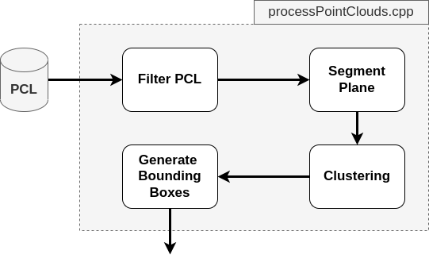

# Project: Lidar Obstacle Detection

## Project pipeline

**Lidar** sensing gives us high resolution data by sending out thousands of laser signals. These lasers bounce off objects, returning to the sensor where we can then determine how far away objects are by timing how long it takes for the signal to return. Also, we can tell a little bit about the object that was hit by measuring the intesity of the returned signal. Each laser ray is in the infrared spectrum, and is sent out at many different angles, usually in a 360 degree range.

To detect the obstacles in the environment, it is necessary to perform a few steps on the pcl. The following figure summarises the pipeline implemented in this projectin order to generate the bounding boxes surrounding the objects detected.



#### Step 1: Filter PCL

The first filtering operation is in charge of removing the points of the car roof (lidar is placed on the roof and some beams hit the car body). Subsequently, the pointcloud is downsampled via a Voxel Grid filter with a resolution of 0.2 m.

#### Step 2: Segment plane
This step is needed in order to produce two different point clouds from the starting one. The output of this step will be a pointcloud containing the points belonging to the road and a second one containing all the other points. The next step will execlusively operate on the second one.

#### Step 3: Clustering
Cluster the obstacle cloud based on the proximity of neighboring points. This step is based on the concept of KdTree, NN and KNN.

#### Step 4: Generate bounding boxes
Finally, we placed geometrically a bounding box around each individual clusters. 

## Final result


## Dependencies

* PCL - v1.10: ``` sudo apt install libpcl-dev ```
* C++ v14
* gcc v9.4

## Local Installation

1. Clone this github repo:

   ```sh
   git clone https://github.com/udacity/SFND_Lidar_Obstacle_Detection.git
   ```

2. Execute the following commands in a terminal

   ```shell
   cd Lidar_Obstacle_Detection
   mkdir build && cd build
   cmake ..
   make
   ./environment
   ```
