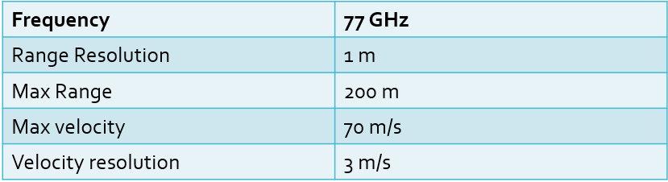
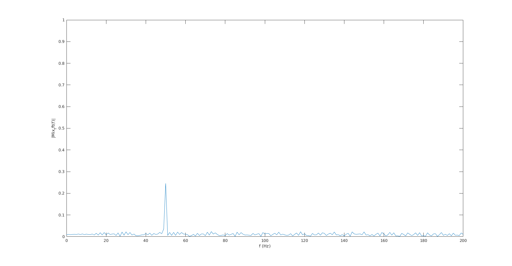
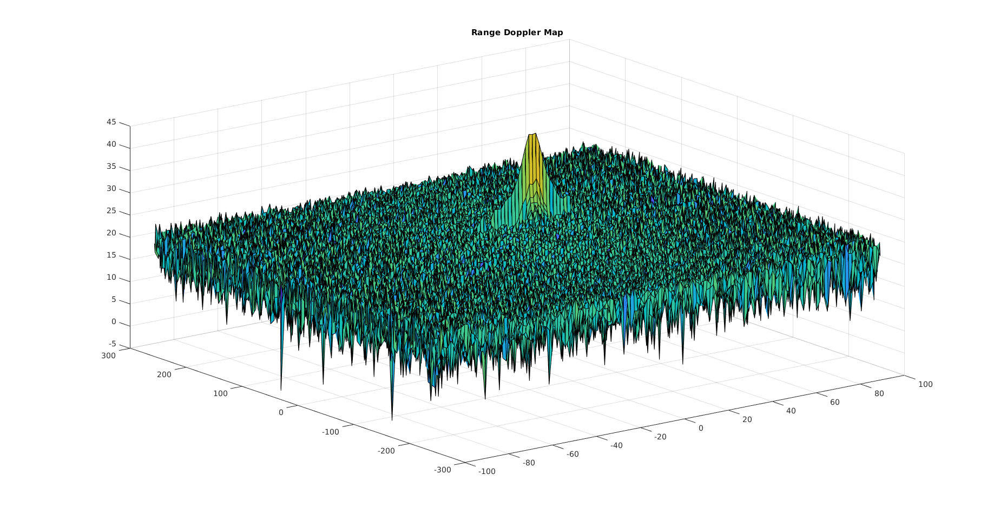
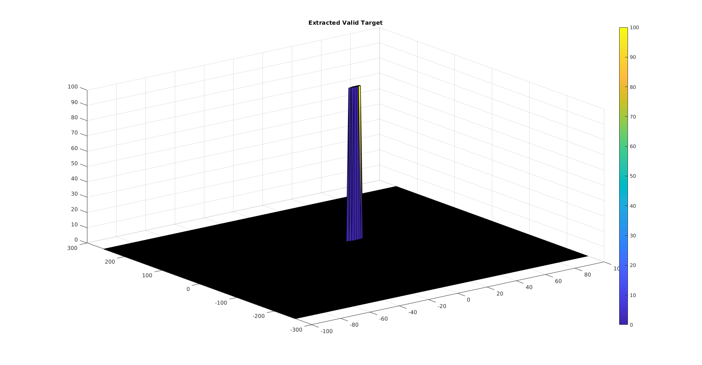

# Project: Radar Target Generation and Detection

The radar’s capability to determine the targets at long range with accurate velocity and spatial information make it an important sensor for self driving applications. Additionally, its capability to sense objects in dark and poor weather (rain, fog) conditions also help it cover the domains where LIDAR or camera may fail.

Given a Radar withthe following characteristics

Consider an object moving in 1D. Given a starting position r_0=50m and a velocity of 20m/s, we want to:
- Configure the FMCW waveform based on the system requirements.
- Define the range and velocity of target and simulate its displacement.
- For the same simulation loop process the transmit and receive signal to determine the beat signal
- Perform Range FFT on the received signal to determine the Range
- Towards the end, perform the CFAR processing on the output of 2nd FFT to display the target.

Following this pipeline, we derive the posizione and the velocity of the target.

The figure below summarises the pipeline.

## Final result

### Position --> Range FFT (1st FFT)

### Velocity --> 2DCFAR

We generate the Range Doppler Map (2D FFT).

To detect the target, we create a window and slide it through the Range Doppler Map.
First we define the number of training cells and guard cells for range dimension (Tr=10, Gr=4) and doppler dimension (Td=8, Gd=4), respectively.
And we also set up the Offset parameter (offset=10) that is used to offset the threshold by SNR value in dB.

Given Nr=1024 and Nd=128, as we only need one side of signal, we slide the defined window through 512x128.
Then we sum up the single (convert from decibels to power) in training cells and take the average of it, and we convert it back to decibels and add the Offset value to it to determine the threshold.

Now we compare the signal under CUT with the threshold value. If the signal under CUT is greater than the threshold, we assign value 1 to it, otherwise we assign value 0 to it. Since CUTs cannot be located at the edges of the matrix, we need to assign value 0 to them. We simply create a double for loop and check if CUTs position is at the edge.
Finally, we use surf function to plot the output of 2D CFAR.

