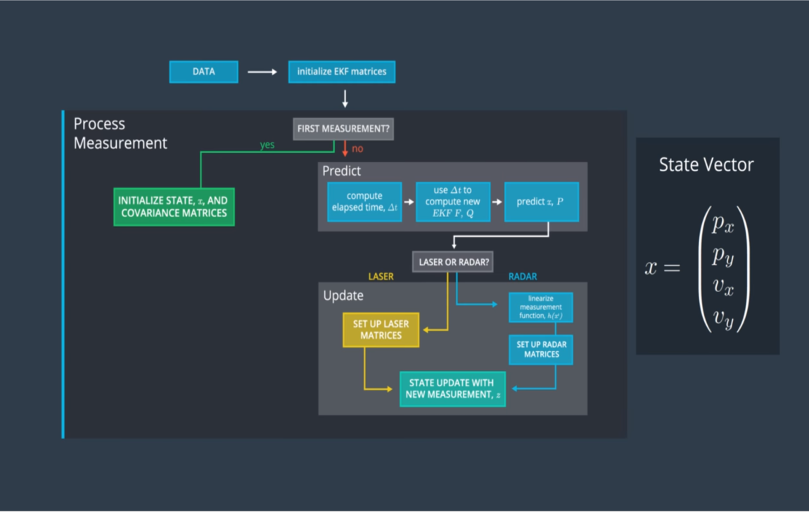
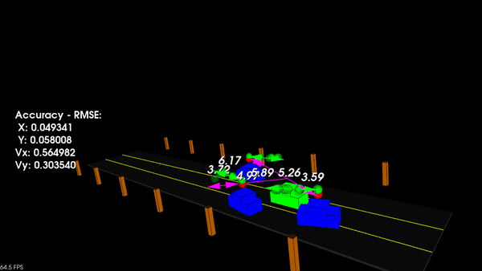

# Project: Unscented Kalman Filter

The main goal of this project is to implement an Unscented Kalman Filter to estimate the state of multiple cars on a highway using noisy lidar and radar measurements. 

State vector of the tracked objects: $\mathbf{x}=[p_x, p_y, v_x, v_y]^T$



### Prediction step
We assume that each object behave according to the Constant Turn Rate and Velocity model (CTRV), described [here](https://github.com/AntoBongio/Sensor_Fusion_Nanodegree/blob/main/05_Unscented_Kalman_Filter/CTRV%20Model.pdf).

### Update step
As observations for the update step, we consider both the lidar and radar to obtain an external partial estimate of the state of each object.
The \textbf{Lidar} is capable of measuring position of the object w.r.t. itself, so it defines a linear correspondence between the observed states $[p_x, p_y]$ and the state vector $[p_x, p_y, v_x, v_y]$. On the contrary, the radar can not directly preceive the state variable of the object, instead it gives a measure of the range, the bearing angle and the range rate of the object. To transform these variables into the state vector, we have to define a non linear correspondence between the two vectors.

## Brief code description

`main.cpp` is using `highway.h` to create a straight 3 lane highway environment with 3 traffic cars and the main ego car at the center. The viewer scene is centered around the ego car and the coordinate system is relative to the ego car as well. The ego car is green while the other traffic cars are blue. The traffic cars will be accelerating and altering their steering to change lanes. Each of the traffic car's has it's own UKF object generated for it, and will update each indidual one during every time step. 

The red spheres above cars represent the (x,y) lidar detection and the purple lines show the radar measurements with the velocity magnitude along the detected angle. The Z axis is not taken into account for tracking, so you are only tracking along the X/Y axis.

## Final result

To evaluate the solution, it is required to obtain RMSE values that are lower than a well defined tolerance. In this video, the RMSE values are always in white, which implies that they are below the threshold.



---

## Dependencies

* PCL - v1.10: ``` sudo apt install libpcl-dev ```
* C++ v14
* gcc v9.4

## Local Installation

1. Clone the entire project github repo:

   ```sh
   git clone git clone https://github.com/AntoBongio/Sensor_Fusion_Nanodegree.git
   ```

2. Execute the following commands in a terminal

   ```shell
   cd 05_Unscented_Kalman_Filter
   mkdir build && cd build
   cmake ..
   make
   ./ukf_highway
   ```
